

  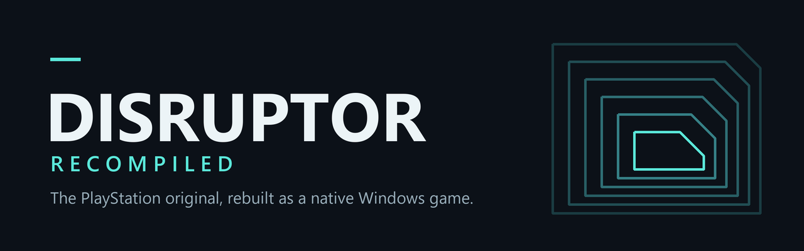

  
  
  

  <b>Play Insomniac's 1996 PlayStation shooter <i>Disruptor</i> as a real Windows game.</b> 
  60 fps · true widescreen · mouse and keyboard · sharp high-resolution graphics

---

## ✨ What you get

| | |
|---|---|
| 🎯 **Smooth 60 fps** | The game draws twice as many frames as the original, while it still plays at its original speed. |
| 🖥️ **Real widescreen** | A true 16:9 view that shows more of the world. Menus and movies keep their original shape. |
| 🖱️ **Mouse and keyboard** | Aim with the mouse, move with WASD, switch weapons with the wheel. Controllers work too. |
| 🔍 **Sharp graphics** | Up to 4× resolution, steady polygons, straight textures and clean, crisp sprites. |
| 🎬 **Better movies** | Cutscenes fill your screen and are smoothed instead of blocky. |
| 💾 **Savestates** | Save anywhere with **F7**, alongside the game's normal memory-card saves. |
| ⚙️ **A launcher with every setting** | Change graphics, controls and more, and rebind any key or mouse button. |

## 📸 Screenshots

  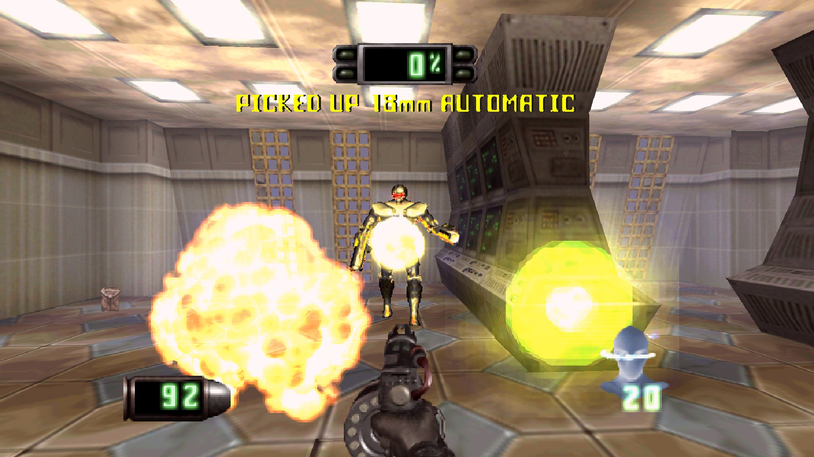

<table>
  <tr>
    <td>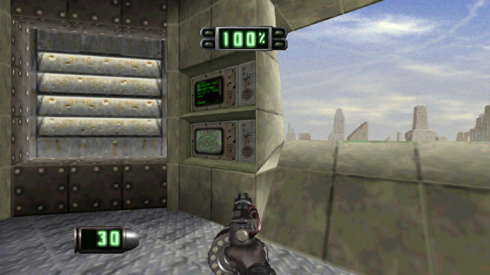</td>
    <td>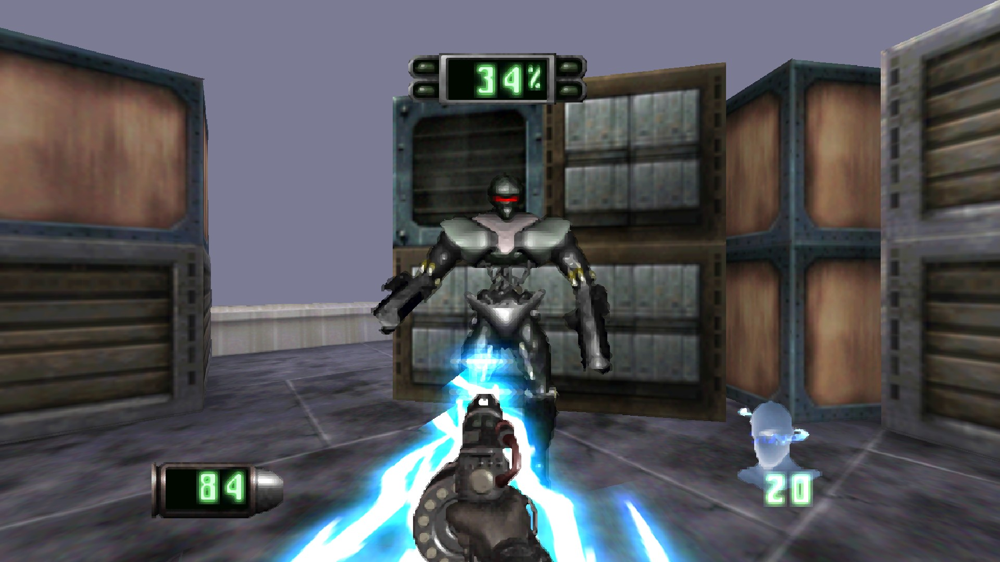</td>
  </tr>
  <tr>
    <td>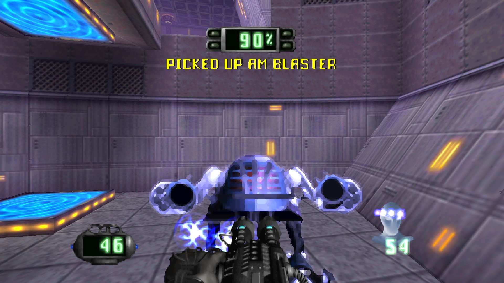</td>
    <td>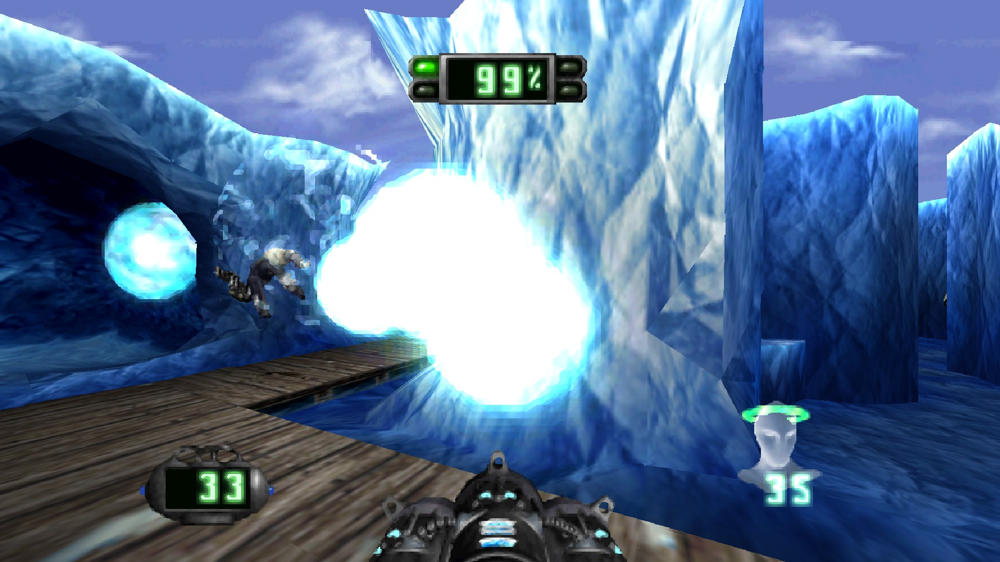</td>
  </tr>
  <tr>
    <td>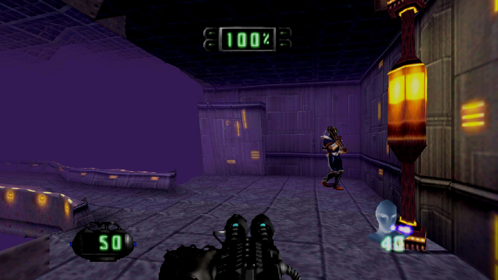</td>
    <td>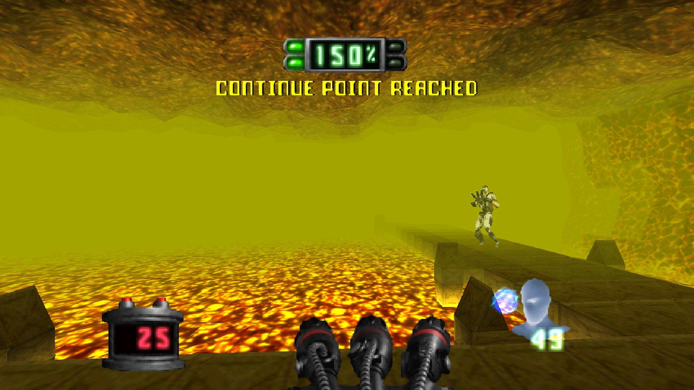</td>
  </tr>
</table>

Captured in widescreen at 1920×1080 with the default settings.

## 💿 What you need

- 🪟 A 64-bit **Windows 10 or 11** PC with a graphics card that supports OpenGL 3.3 (almost any PC from the last 10 years).
- 📀 **Your own copy of Disruptor for the PlayStation (USA version)**, as a disc image (`.bin` or `.iso`).
- 💽 About **1 GB** of free space during installation.

That's all. No emulator, no BIOS file, no extra tools.

> [!NOTE]
> **This download contains no part of the game.** Setup builds the game on your PC from your own disc,
> which is why you need a copy of Disruptor.

## 🚀 Install

1. **Download** `DisruptorRecompiled-…-Setup.exe` from the [Releases page](https://github.com/Phroster/DisruptorRecomp/releases/latest).
2. **Run it** and pick your Disruptor disc image when Setup asks. If you have a `.cue` and a `.bin` file, pick the `.bin`.
3. **Wait about a minute** while Setup builds the game from your disc. A progress bar shows each step.
4. **Play!** Open **Disruptor Recompiled** from the Start menu and click **PLAY DISRUPTOR**.

> [!TIP]
> Windows may show *"Windows protected your PC"* because the installer is new and not signed.
> Click **More info** → **Run anyway**.

### 🛠️ How does that work?

Disruptor was written for the PlayStation's processor. This project translates the
game's original program into code a Windows PC runs directly. That is why it's a
real Windows game, not an emulator. Because the game belongs to its makers, the
download only brings the translation tools and the improvements. Setup reads the
program from **your** disc, translates it, builds it, and double-checks every step
so you get exactly the tested game.

## 🎮 The launcher

  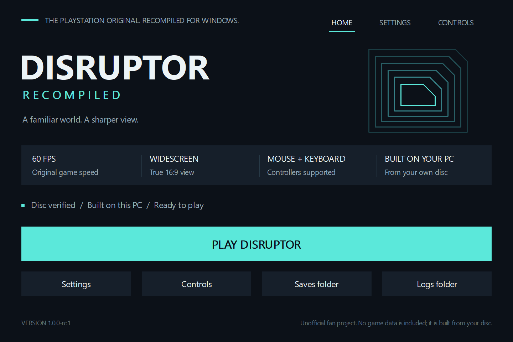

| Button | What it does |
|---|---|
| **PLAY DISRUPTOR** | Starts the game. If the game still has to be built, it says **BUILD THE GAME** instead. |
| **Settings** | Every option, sorted into Display, Graphics, Controls, Audio and Advanced. |
| **Controls** | Shows what each key does and lets you change it. |
| **Saves folder** | Opens the folder with your memory cards and savestates. |
| **Logs folder** | Opens the logs. Attach these when you report a problem. |

The launcher checks your disc image each time it starts. Close it any time; the game keeps running.

## ⚙️ Settings

  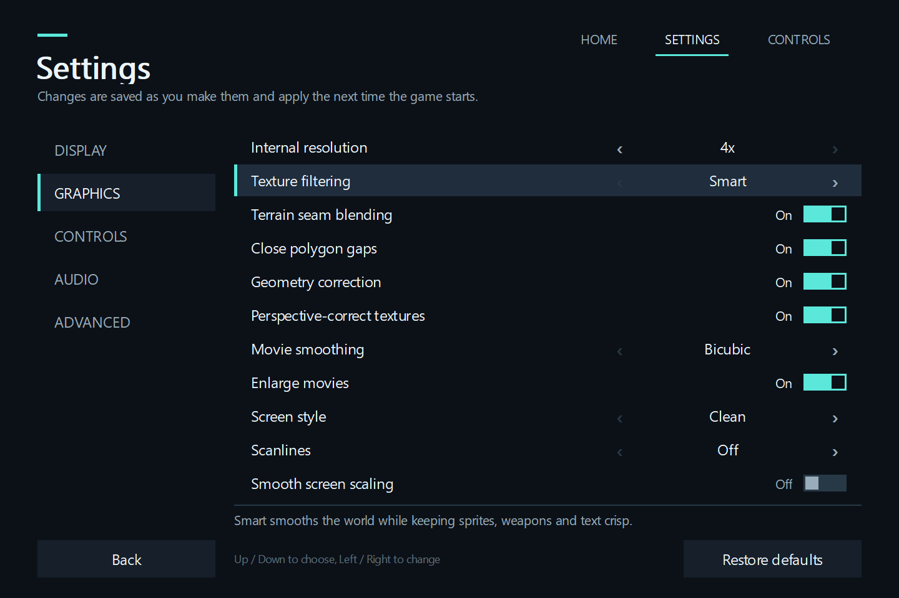

Click an option (or use the arrow keys) to change it. Changes are saved right away and apply the next time you start the game.
**Restore defaults** resets the page you're on.

<b>🖥️ Display</b>

| Setting | What it does |
|---|---|
| Window mode | Borderless fullscreen (recommended), windowed, or exclusive fullscreen. **Alt+Enter** switches while playing. |
| Window size | How wide the window is when you play windowed. |
| Widescreen 16:9 | Shows more of the world on wide screens. Turn off for the original 4:3 picture. |
| Vertical sync | *Off* gives the snappiest controls and suits G-SYNC/FreeSync screens. Turn on if you see tearing. |
| Low-latency input | Makes controls feel more direct. |

<b>🎨 Graphics</b>

| Setting | What it does |
|---|---|
| Internal resolution | How sharp the 3D world is drawn, from the original (1×) up to 4×. |
| Texture filtering | *Smart* smooths the world and keeps enemies, weapons and text crisp. *Original pixels* looks like the PlayStation. |
| Terrain seam blending | Hides the lines between ground tiles. |
| Close polygon gaps | Hides thin cracks between polygons. |
| Geometry correction | Stops the classic PlayStation wobble of polygons. |
| Perspective-correct textures | Stops textures on walls and floors from warping. |
| Movie smoothing | How the cutscenes are scaled up. |
| Enlarge movies | Makes cutscenes as big as your screen allows. |
| Screen style | Clean picture, or the colours of an old TV. |
| Scanlines | Adds TV scanlines. **F6** turns them on and off while playing. |
| Smooth screen scaling | Softens the picture a little when it's stretched to your screen. |

<b>🖱️ Controls</b>

| Setting | What it does |
|---|---|
| Mouse look | Turn with the mouse. |
| Mouse sensitivity | How fast the view turns. |
| Smooth turning | Makes mouse turning perfectly smooth. |
| Mouse wheel selects weapons | Scroll to change weapons; hold **R** and scroll for psionic powers. |
| Controller | Use a gamepad together with keyboard and mouse, or keyboard and mouse only. |
| Stick deadzone | How far a stick has to move before it counts. |
| Keys and mouse buttons | Opens the Controls page. |

<b>🔊 Audio</b>

| Setting | What it does |
|---|---|
| Output sample rate | 44.1 or 48 kHz. Use **keypad +/-** to change the volume while playing. |
| High-quality sound processing | Slightly more precise sound mixing. |

<b>🧪 Advanced</b>

| Setting | What it does |
|---|---|
| Console CPU speed | 300% keeps busy scenes at a steady 60 fps. 100% is the original console. The game's speed doesn't change. |
| Frame interpolation *(experimental)* | Adds in-between frames for high-refresh monitors. |
| Fast-forward speed | How fast **Tab** fast-forwards. **F9** keeps it on. |
| Show FPS counter | Shows the frame rate. **F10** toggles it while playing. |
| Faster loading *(experimental)* | Shortens loading times. |
| Rebuild the game | Builds the game again from your disc, if something ever goes wrong. |

## ⌨️ Controls

  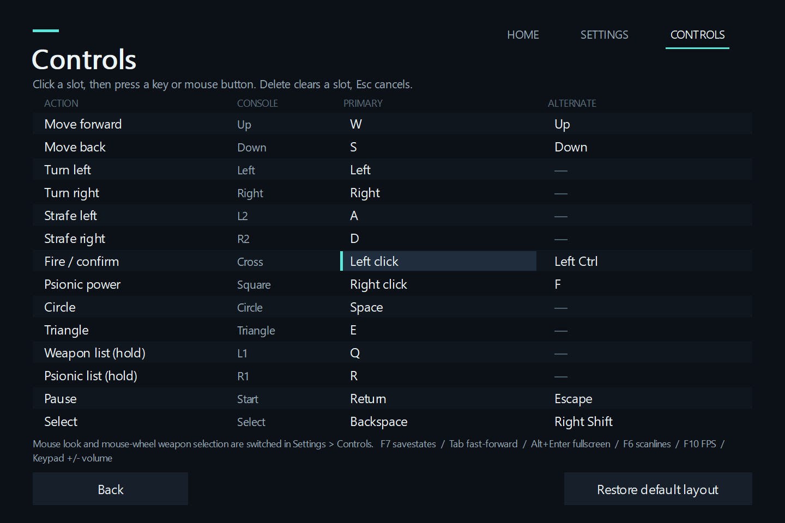

| Action | Keyboard and mouse |
|---|---|
| Move forward / back | **W** / **S** (or ↑ / ↓) |
| Strafe left / right | **A** / **D** |
| Turn | **Mouse** (or ← / →) |
| Fire / confirm | **Left click** or **Left Ctrl** |
| Psionic power | **Right click** or **F** |
| Change weapon | **Mouse wheel** |
| Change psionic power | Hold **R** + **mouse wheel** |
| Weapon / psionic list | Hold **Q** / **R**, step with **W**/**S**, release to pick |
| Pause | **Enter** or **Esc** |

In menus, **W/S** or the arrow keys move and **Left Ctrl** confirms. Controllers work out of the box.

**To change a key:** open **Controls**, click a slot, then press the key or mouse button you want. **Delete** clears a slot, **Esc** cancels.

| Hotkey | |
|---|---|
| **F7** | Savestate menu (save and load anywhere) |
| **Alt+Enter** | Fullscreen on/off |
| **Tab** (hold) / **F9** | Fast-forward / fast-forward on/off |
| **F6** | Scanlines on/off |
| **F10** | FPS counter on/off |
| **Keypad + / -** | Volume |

## 💾 Saves, updates and uninstalling

- 💾 Your saves live in `%LOCALAPPDATA%\DisruptorRecompiled\saves`. The **Saves folder** button takes you there.
- ⬆️ **Updating:** run the new Setup. It remembers your disc, keeps your settings and saves, and builds the new version.
- 🗑️ **Uninstalling:** use *Windows Settings → Apps*. Your saves and settings stay; your original disc image is never touched.

> [!TIP]
> Savestates are handy, but keep using the game's own memory-card saves too. They carry over between versions.

## ❓ Help

<b>Setup says my disc image isn't right</b>

Only the **USA** version of Disruptor works. Pick the full `.bin` file (about 607 MB), not the `.cue` file or a zip archive.
Images converted to other formats (for example a 2048-byte `.iso`, `.chd` or `.pbp`) won't work. Make a fresh copy from your disc.

<b>The build didn't finish</b>

Open the launcher and click **BUILD THE GAME** to try again. If it fails again, click **Logs folder** and attach
`build-last.log` to a [bug report](https://github.com/Phroster/DisruptorRecomp/issues).

<b>The game doesn't start or closes</b>

Update your graphics driver, then try again. If it keeps happening, attach `game-last.log` from the **Logs folder** to a
[bug report](https://github.com/Phroster/DisruptorRecomp/issues).

<b>It stutters or runs slowly</b>

Lower **Internal resolution** in Settings → Graphics, and make sure **Console CPU speed** is 300%.

## 🤝 Help test and improve it

This is a **release candidate**: it's ready to play, and we'd love your help to find what's still wrong before the final release.

- 🐞 **Found a bug?** [Open an issue](https://github.com/Phroster/DisruptorRecomp/issues) and tell us the level, what you did and what happened. Attach the logs from the launcher's **Logs folder**.
- 🎮 **Played through a level?** Let us know it works, and which PC, graphics card and controller you used.
- 📸 **Screenshots and videos** of the game running are very welcome.
- 🧑‍💻 **Developers:** see [CONTRIBUTING.md](CONTRIBUTING.md) and [docs/BUILDING.md](docs/BUILDING.md).

## 🙏 Credits

- **[PSXRecomp](https://github.com/RetroPortingToolKit/psxrecomp)**, the tools that translate PlayStation games into native code.
- **[OpenBIOS](https://github.com/grumpycoders/pcsx-redux)** from the PCSX-Redux project, the free replacement for the PlayStation BIOS.
- **[SDL](https://www.libsdl.org/)**, and the GCC and MinGW-w64 projects, whose tools build the game on your PC.

## ⚖️ Legal

*Disruptor* was developed by Insomniac Games and published by Universal Interactive Studios.
This is an unofficial, non-commercial fan project. It is not affiliated with or endorsed by the game's owners.
It contains no game code, graphics, sound or other game data; you need your own copy of the game.

The project is shared under the [PolyForm Noncommercial License 1.0.0](LICENSE): free to use, share and change, but not to sell.
Third-party licenses are included with the installer.
